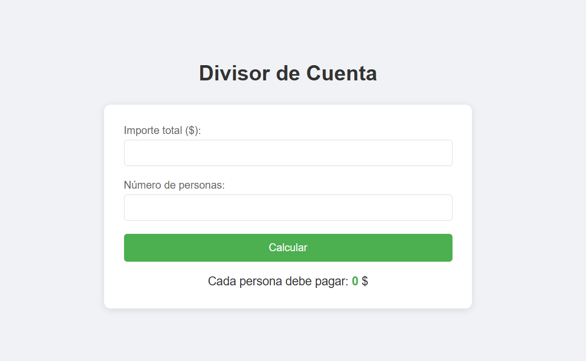

# Aplicación para Dividir una Cuenta de Restaurante entre Amigos

**Descripción**

Esta aplicación permite calcular de manera sencilla y rápida cuánto debe pagar cada amigo al dividir una cuenta de restaurante. Se desarrolla utilizando HTML, CSS y JavaScript (archivos separados) para una estructura organizada y fácil mantenimiento.

**Tecnologías Utilizadas**

HTML5: Para la estructura del sitio web.

CSS3: Para el diseño y estilizado de la aplicación.

JavaScript (ES6+): Para la lógica de cálculo y funcionalidad de la aplicación.

**Características**

Ingreso del importe total de la cuenta.

Ingreso del número de amigos que van a dividir la cuenta.

Cálculo automático del importe que debe pagar cada persona.

Botón para limpiar los valores y realizar un nuevo cálculo.
